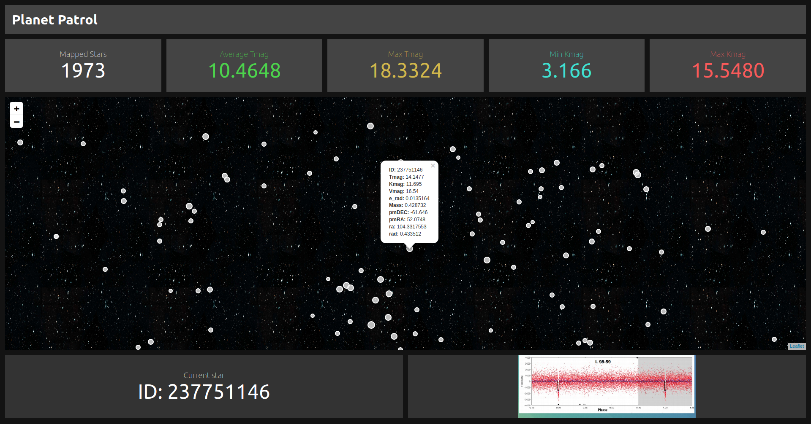

# Planet Patrol

React App with a Leaflet.js map that displays discovered stars according to their size and with a popup containing the star information.

<br />



## Requirements

To run this project you must have `Node.js` installed in your computer.

## Setup

Clone the repositroy and navigate to its folder. Install dependencies running:
```
npm i
```

Start the project in the browser running:
```
npm run start
```

